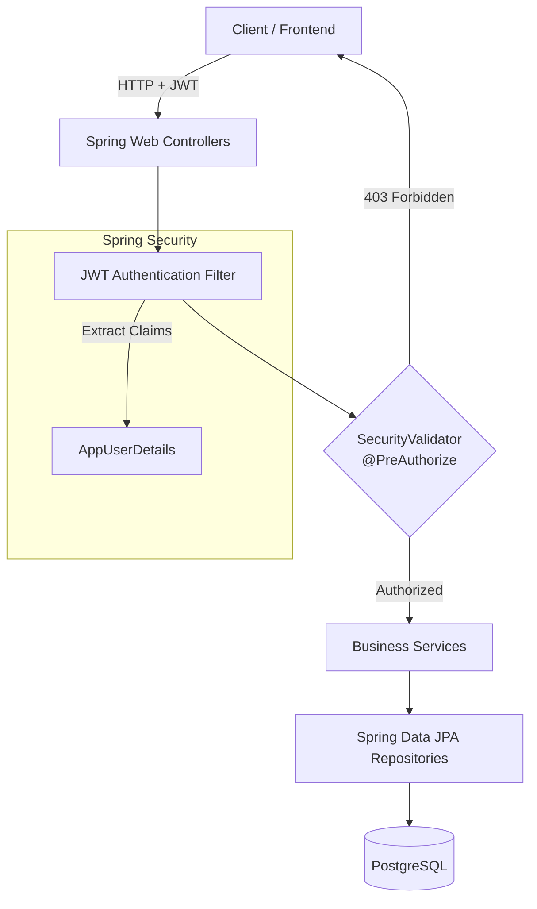
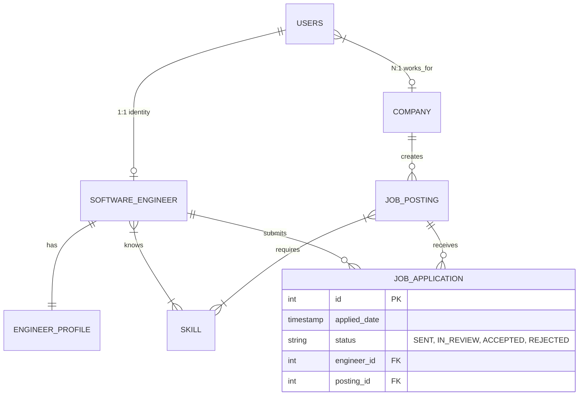

# Job Platform API

A production-grade Spring Boot 3 REST API for a technical recruitment platform. This system facilitates the connection between Software Engineers and Companies, providing a secure, role-based ecosystem for job postings, profile management, and state-driven job applications.

## Tech Stack

- **Framework:** Java / Spring Boot 3 / Spring Web
- **Database:** PostgreSQL 16
- **Persistence:** Spring Data JPA / Hibernate
- **Migrations:** Flyway
- **Security:** Spring Security 6 / stateless JWT Authentication
- **Tooling:** MapStruct (DTO Mapping), Lombok, Docker Compose
- **API Documentation:** OpenAPI / Scalar
- **CI/CD:** Jenkins (Pipeline provided)

## Architecture & Security

The system employs a strict **Identity + Domain** pattern. Authentication concerns are entirely decoupled from domain entities. A central `User` identity manages credentials and issues stateless JWTs embedded with domain-specific IDs, allowing for blazing-fast, O(1) in-memory authorization checks at the controller boundary.

### System Architecture



### Entity Relationship Diagram (ERD)



## Key Features

- **Role-Based Access Control (RBAC):** Strict boundaries utilizing `@PreAuthorize` to prevent IDOR (Insecure Direct Object Reference) and unauthorized state mutations.
- **Deterministic State Machine:** Job application transitions (e.g., `SENT` -> `IN_REVIEW`) are enforced at the compile level, with invalid transitions throwing specific `422 Unprocessable Entity` errors.
- **Database-Level Idempotency:** Composite unique constraints ensure an engineer can mathematically never submit duplicate applications for the same role.
- **JPA Entity Auditing:** Automatic, lifecycle-aware `created_at` and `updated_at` timestamps using Spring `@EnableJpaAuditing`.
- **N+1 Query Prevention:** Strategic use of `@EntityGraph` and selective lazy loading ensures highly optimized database trips.
- **RFC 7807 Error Handling:** Global exception interception mapping domain and security errors to standardized `ProblemDetail` JSON responses.

## Local Development Setup

### Prerequisites

- Docker & Docker Compose
- Java 17+ (Pipeline assumes 17, project properties default to latest)
- Maven

### Running the Application

1. **Start the Database**
   Spin up the PostgreSQL container using Docker Compose:

```bash
docker-compose up -d db

```

2. **Run the Application**
   Use the Maven wrapper to start the Spring Boot app. Flyway will automatically run the migrations and create the schema.

```bash
./mvnw spring-boot:run

```

3. **Explore the API**
   Once the application is running on `http://localhost:8080`, you can access the beautiful, interactive API documentation generated by Scalar:

- **Docs:** [http://localhost:8080/reference](https://www.google.com/search?q=http://localhost:8080/reference)

_(Note: If the `dev` profile is active, `DataInitializer.java` will pre-seed the database with users, companies, and skills for immediate testing)._

## Testing

The repository includes integration tests utilizing H2 in-memory databases and MockMvc. To run the test suite:

```bash
./mvnw test
```
